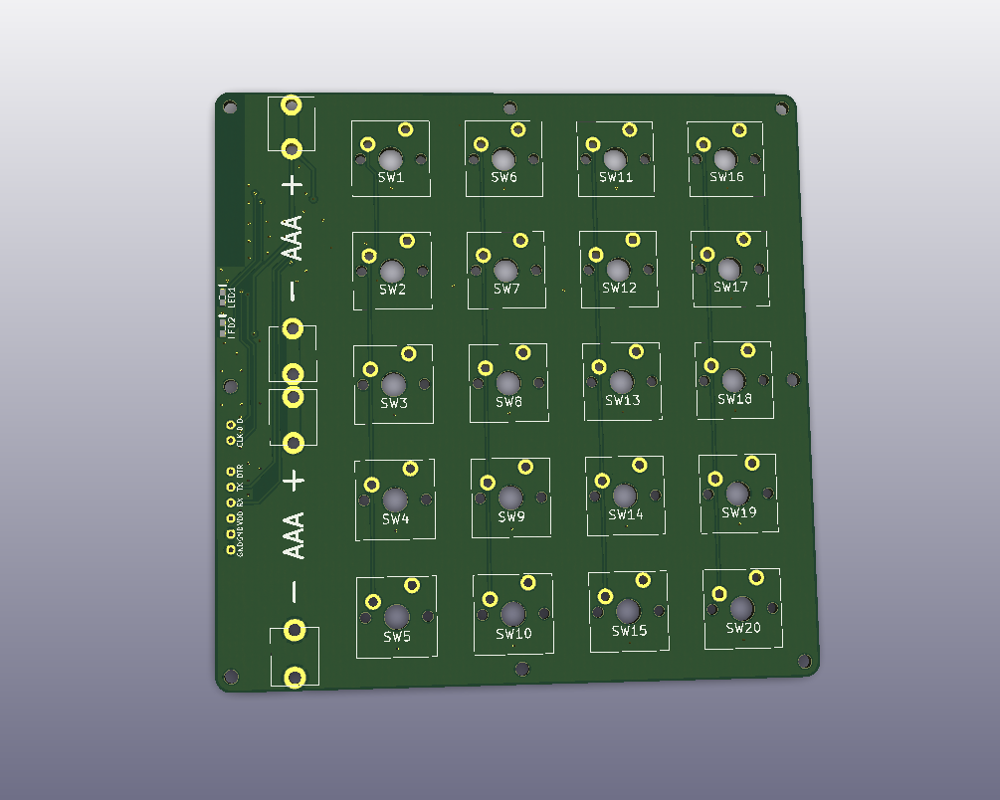
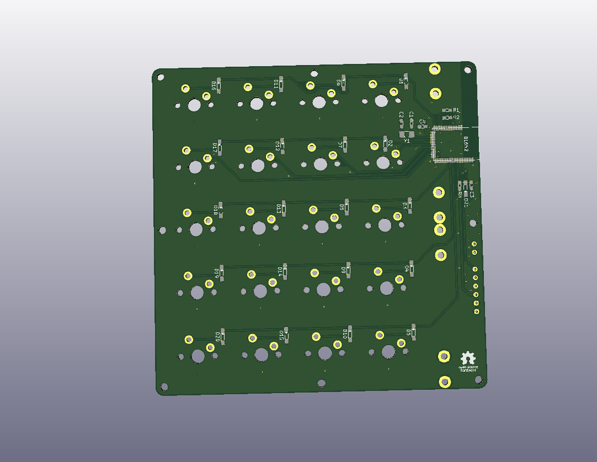
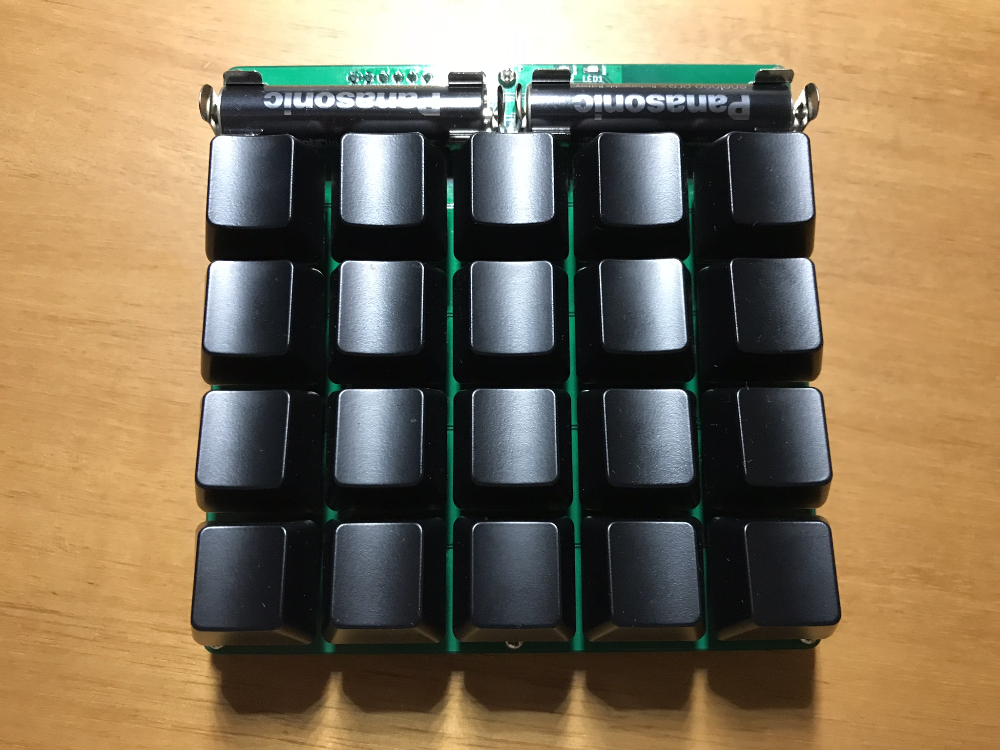

# 4x5-wireless-keypad-pcb

## 部品表

| Name | Qty | Description | Manufacturer
----|----|----|----
| U1 | 1 | BL652-SA-01 | LairdTech |
| Y1 | 1 | Crystal, FC-135, 32.768kHz, 9pF | EPSON |
| C1,C2 | 2 | Capacitor, 12pF, 1608 ||
| C3,C4 | 2 | Capacitor, 0.1uF, 1608 ||
| R1 | 1 | Resistor, 1k Ohm, 1608 ||
| R2 | 1 | Resistor, 330 Ohm, 1608 ||
| R3 | 1 | Resistor, 10k Ohm, 1608 ||
| D1~21 | 21 | Diode, 1N4148W | Diodes Incorporated |
| LED1 | 1 | Led, Red, 1608 ||
| LED2 | 1 | Led, Yellow Green, 1608 ||
| SW1~20 | 20 | Switch, Cherry Mx | Cherry |
| BT1,2 | 4 | Battery Clips, BC-0402 | COMFORTABLE ELECTRONIC |

## License

https://creativecommons.org/licenses/by/4.0/
